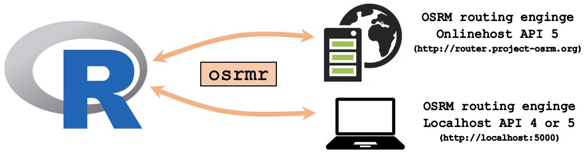

```{r setup, include=FALSE, message=FALSE, results='hide'}
knitr::opts_chunk$set(echo = TRUE)
knitr::opts_chunk$set(message = FALSE)
# knitr::opts_chunk$set(results = 'hide')
```

<!-- Code for adding footnotes: footnotes^[This is a footnote.] -->

'osrmr' is a little R package designed to easily access and use the OSRM (open source routing machine - 
http://project-osrm.org/) directly from R.  
  
Many problems with geocoding tasks can be solved in R. Yet, there is no direct routing engine 
implemented. For such tasks, OSRM is a widely used tool to access geospacial data and solve 
routing problems. The 'osrmr' package gives the possibility to access a basic functionality of OSRM. 

```{r, echo = F, out.width = "690px"}

```

### server

You can access the OSRM-routing-engine with the onlinehost of OSRM (API 5) or by running
a localhost of OSRM (API 4 or 5) on your device. As far as I know, there is no simple way 
to access the onlinehost of the OSRM API 4.
  
In order to use the localhost you need a local build of the OSRM-routing-engine (https://github.com/Project-OSRM/osrm-backend/wiki/Building-OSRM). Keep the local build in 
a directory of your choice. This directory should contain a map of the area you want to 
work with (i.e. `"switzerland-latest.osrm"`, `"germany-latest.osrm"`, `"great-britain.osrm"`,
...) and other data and scripts. 

 * Start your localhost by calling `run_server()`
 * `run_server()` returns the `error_code` of the starting-attempt (`0` means the start was successful)
 * You're now set up to use the functionalities of the 'osrmr' package
 * After finishing all calculations you can stop your localhost with the function by calling `quit_server()`
 * It's recommended to use an Environment Variable for the path of your local build (see examples).

```{r, eval=FALSE}
library(osrmr)

# Set the path of your localhost as environment variable
Sys.setenv("OSRM_PATH"="C:/OSRM_API5")

# start localhost of OSRM
run_server("switzerland-latest.osrm")
quit_server() # quit the running server

```


## use OSRM in R

With the 'osrmr' package you can use the following basic functionalities of OSRM: 

 * [nearest](#nearest)
 * [viaroute](#viaroute)
 * [decoder](#decoder)

The coordinate-standard for all functionalities of 'osrmr' is **WGS84**.  
  
Keep in mind that different API's and localhost/onlinehost may return different results. There 
are pro's and con's for using one specific configuration. When choosing your configuration 
keep the following points in mind: 

 * The onlinehost is always most up-to-date. You can be sure to make calculations with very 
   up-to-date maps and routing-engines. 
 * The onlinehost might sometimes not be available due to maintenance or connection problems. 
 * The onlinehost is slower than the localhost since every calculation represents an individual 
   request to the OSRM server.
 * The localhost is a fixed build which stays the same - so be cautious not to get out of date...
 * The localhost is always available.

### nearest {#nearest}

For given coordinates, you can calculate the nearest position which can be accessed by car by
using the function `nearest()`. You can specify the coordinates, the API version and whether
to use the localhost or not. 

```{r, eval = FALSE}
library(osrmr)
nearest(lat = 47, lng = 8, api_version = 5, localhost = FALSE)
```

```{r, eval = FALSE}
run_server("switzerland-latest.osrm")
nearest(lat = 47, lng = 8, api_version = 5, localhost = TRUE)
quit_server()
#        lat      lng
# 1 47.00008 8.003016

```


Results may differ depending on the api version and the build of the localhost (or onlinehost). 


### viaroute {#viaroute}

For a given start- and end-destination, you can access route informations using `viaroute()`.
OSRM chooses the nearest point which can be accessed by car for the start- and end-destination.
You can choose whether to return only the traveltime (in seconds, as numeric) or 
more details of the route (as list), by setting the parameter `instructions`. 

```{r, eval = FALSE}
viaroute(lat1 = 47.1, lng1 = 8.1, lat2 = 46.9, lng2 = 8.3, instructions = FALSE,
         api_version = 5, localhost = FALSE)

viaroute(lat1 = 47.1, lng1 = 8.1, lat2 = 46.9, lng2 = 8.3, instructions = TRUE,
         api_version = 5, localhost = FALSE)
```


### decoder {#decoder}

Use `decode_geom()` to decode polylines. Polylines can be generated with OSRM (see example 
below). Depending on the OSRM API version, the precision for [lat, lng] encoding is different. 

 * API 4 used "polyline" with precision 5 (`1e-5`)
 * API 5 uses "polyline6" with precision 6 (`1e-6`)

To decode a polyline the right way you need to know the precision of the polyline. The parameter
`precision` of `decode_geom()` accepts the values 5 (`1e-5`) or 6 (`1e-6`) to decode a polyline. 
```{r, eval = FALSE}
polyline_5 <- rjson::fromJSON(file = "http://router.project-osrm.org/route/v1/driving/8.1,47.1;8.3,46.9?steps=false&geometries=polyline")$routes[[1]]$geometry
polyline_6 <- rjson::fromJSON(file = "http://router.project-osrm.org/route/v1/driving/8.1,47.1;8.3,46.9?steps=false&geometries=polyline6")$routes[[1]]$geometry

decoded_5 <- decode_geom(polyline_5, precision = 5)
decoded_6 <- decode_geom(polyline_6, precision = 6)

options(digits = 10)
decoded_5[1:5,]
decoded_6[1:5,]

nrow(decoded_5)
nrow(decoded_6)
```

The differences of precisions 5 and 6 are smaller than a tolerance of `1e-6`.
```{r, eval = FALSE}
assertthat::assert_that(all.equal(decoded_5, decoded_6, tolerance = 1e-6))
```

```{r}
Sys.unsetenv("OSRM_PATH")
```

